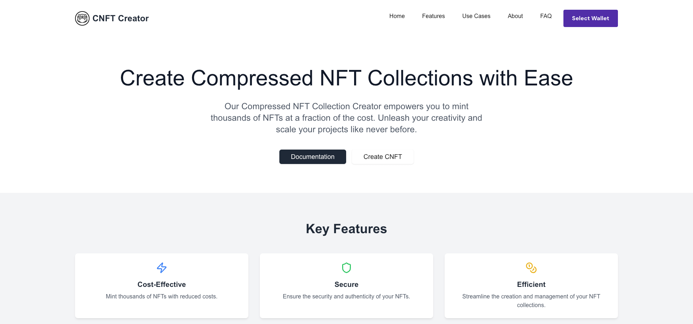

# CNFT Collection Creator

Welcome to the CNFT Collection Creator! This project allows you to mint compressed NFT collections on the Solana blockchain. It provides a streamlined interface for creating, managing, and scaling NFT projects with ease.

This is a [Next.js](https://nextjs.org) project bootstrapped with [`create-next-app`](https://nextjs.org/docs/app/api-reference/cli/create-next-app).

## Getting Started

First, run the development server:

```bash
npm run dev
# or
yarn dev
# or
pnpm dev
# or
bun dev
```

Open [http://localhost:3000](http://localhost:3000) with your browser to see the result.

You can start editing the page by modifying `app/page.tsx`. The page auto-updates as you edit the file.

This project uses [`next/font`](https://nextjs.org/docs/app/building-your-application/optimizing/fonts) to automatically optimize and load [Geist](https://vercel.com/font), a new font family for Vercel.

## Features

- **Cost-Effective**: Mint thousands of NFTs with reduced costs.
- **Secure**: Ensure the security and authenticity of your NFTs.
- **Efficient**: Streamline the creation and management of your NFT collections.

## Installation

1. Clone the repository:

    ```bash
    git clone https://github.com/your-username/cnft-collection-creator.git
    ```

2. Navigate to the project directory:

    ```bash
    cd cnft-collection-creator
    ```

3. Install dependencies:

    ```bash
    yarn install
    # or
    npm install
    ```

4. Set up environment variables. Create a `.env.local` file in the root directory and add the following:

    ```env
    NEXT_PUBLIC_SUPABASE_URL=your-supabase-url
    NEXT_PUBLIC_SUPABASE_ANON_KEY=your-supabase-anon-key
    NEXT_PUBLIC_SOLANA_NETWORK=devnet
    NEXT_PUBLIC_SOLANA_RPC_URL=https://api.devnet.solana.com
    NEXT_PUBLIC_MINT_API_URL=https://nftcreator.app/mint // Example
    TOKEN_PROGRAM_ID=TokenkegQfeZyiNwAJbNbGKPFXkQd5J8X8wnF8MPzYx
    SECRET_KEY=your-secret-key-here
    JWT_SECRET=your-jwt-secret-key-here
    NODE_ENV=development
    ```

5. Start the development server:

    ```bash
    yarn dev
    # or
    npm run dev
    ```

6. Open [http://localhost:3000](http://localhost:3000) to see the app in action.

## Learn More

To learn more about Next.js, take a look at the following resources:

- [Next.js Documentation](https://nextjs.org/docs) - Learn about Next.js features and API.
- [Learn Next.js](https://nextjs.org/learn) - An interactive Next.js tutorial.

You can check out [the Next.js GitHub repository](https://github.com/vercel/next.js) - Your feedback and contributions are welcome!

## Deploy on Vercel

The easiest way to deploy your Next.js app is to use the [Vercel Platform](https://vercel.com/new?utm_medium=default-template&filter=next.js&utm_source=create-next-app&utm_campaign=create-next-app-readme) from the creators of Next.js.

Check out our [Next.js deployment documentation](https://nextjs.org/docs/app/building-your-application/deploying) for more details.

## Screenshots



## Contributing

Contributions are welcome! If you have any improvements or bug fixes, please submit a pull request or open an issue.

## License

This project is licensed under the MIT License - see the [LICENSE](LICENSE) file for details.

## Acknowledgments

- Thanks to the Solana community and the creators of the libraries used in this project.
- Inspired by the vision of making NFT creation accessible and scalable.
